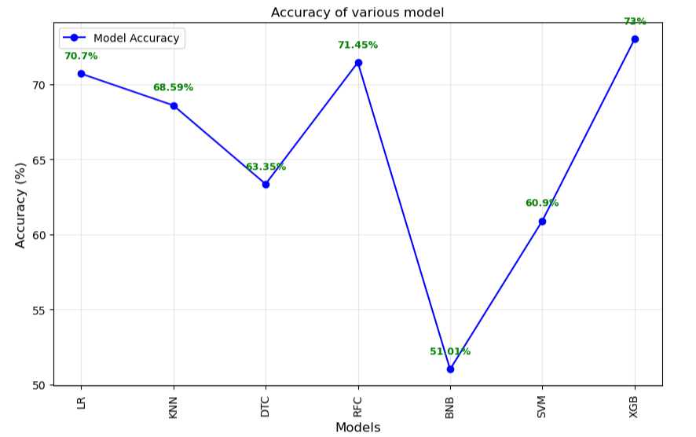
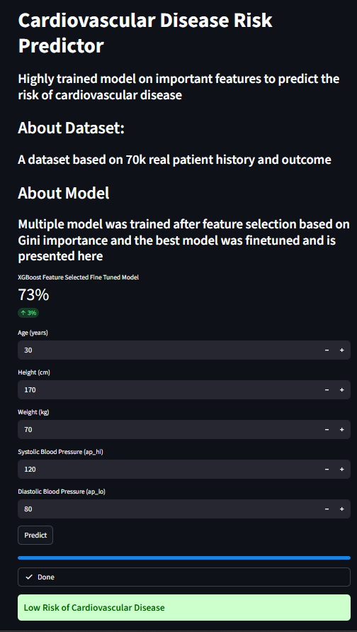
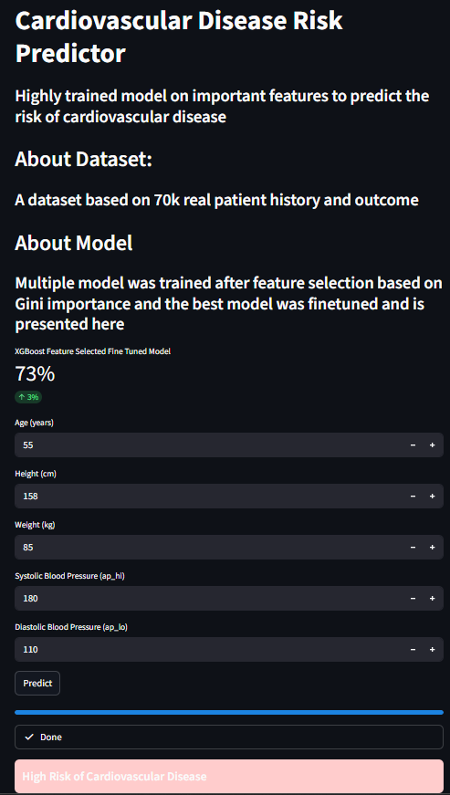

# Cardiovascuar_Disease_Prediction
This project aims to bring a machine learning solution for prognosing cardiovascular disease risk and provide an end-to-end streamlit interface for user friendly interaction. 

## Table of Content
- [Libraries Used](#libraries-used)
- [Dataset](#dataset)
- [Model Selection](#model-selection)
- [Getting Started](#getting-started)
- [StreamLit App](streamlit-app)
- [Future Scope](future-scope)

## Libraries Used

This project utilizes several Python libraries for data manipulation, visualization, and machine learning:
```python
Numpy, Pandas, Scikit-Learn, Matplotlib, Seaborn, XGBoost
```

## Dataset
[Kaggle Dataset Link](https://www.kaggle.com/datasets/sulianova/cardiovascular-disease-dataset)

70,000 record with a dozen of features of patients recorded during examination with balanced classes for disease or not.

## Model Selection

Multiple machine learning models were considered for predicting cardiovascular disease risk, including:

- Logistic Regression
- Decision Tree Classifier
- Random Forest Classifier
- K-Nearest Neighbors Classifier
- Support Vector Classifier (SVC)
- Bernoulli Naive Bayes Classifiers 
- XGBoost Classifier

After conducting hyperparameter tuning on these models, the following accuracies were achieved:

- **XGBoost**: 73% (Selected as the primary model)
- **Logistic Regression**: 72%

The models were evaluated based on their accuracy scores, with XGBoost emerging as the most reliable option for this dataset.


## Getting Started

1. Clone the repository using the command below.
```bash
git clone https://github.com/UmerSalimKhan/Cardiovascular_Disease_Prediction.git
```

2. Navigate to the project directory.
```bash
cd Cardiovascular_Disease_Prediction
```

3. Install the required dependencies as specified in the `requirements.txt` file.
```bash
pip install -r requirements.txt
```

4. Run the application using your preferred method (e.g., Streamlit).
```bash
streamlit run app.py
```

**Note:** Don't forget to download the dataset, run the .ipynb notebook to get the model, and set the paths correctly first. Or else, you will run out into a disappointing error.

## StreamLit App
### Image of Not Disease 



###  Image of Disease



### Working of App


## Future Scope
There can be achieve a lot in this project. 
1. Dealing with Xrays/ MRIS
2. Implementing more advance models or neural networks
3. Fixing Autogluon work and giving a year mortality rate
4. Making the UI more rich in user experience
